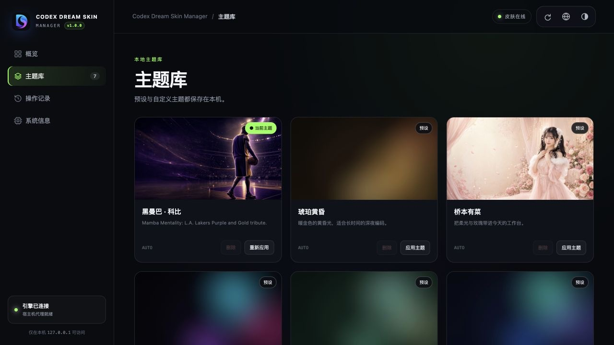

<p align="center">
  
</p>

<h1 align="center">Codex Dream Skin Manager</h1>

<p align="center">A local theme management panel for Codex Dream Skin on macOS.</p>

<p align="center">
  <a href="README.md">简体中文</a> · <strong>English</strong>
</p>

<p align="center">
  
  
  
  
  <a href="LICENSE"></a>
  <a href="https://github.com/StarRain/Codex-Dream-Skin-Manager/actions/workflows/ci.yml"></a>
</p>

Codex Dream Skin Manager is an independent local Web GUI that manages themes, injection state, and the Codex connection through the macOS scripts supplied by the original project. It neither copies nor modifies the theme engine source code, and it does not modify the official Codex app.

> The current release targets macOS only and requires the [Codex Dream Skin](https://github.com/Fei-Away/Codex-Dream-Skin) theme engine.

## Preview




## Core Capabilities

### Theme Management

- Browse local preset and custom themes
- Preview theme backgrounds and identify the active theme
- Create `custom-*` themes from local images with live home-page and task-page previews
- Adjust appearance, safe area, task-page artwork mode, and automatic or manual focus
- Apply or reapply a theme with one click
- Delete custom themes with confirmation
- Protect preset themes and the active theme from accidental deletion

### Runtime Status

- Inspect the skin session, Codex, CDP, and injector state
- Apply the skin, pause injection, or restore the official appearance
- Review operation records from the current Host Agent lifecycle
- Manually refresh configuration, runtime state, themes, and logs

### User Experience

- Simplified Chinese and English UI
- System, light, and dark appearance modes
- Local system information, version display, and repository shortcuts
- Default entry point: `http://localhost:19341/management.html`

## Architecture

Homebrew and Shell installations use native integrated mode by default. One loopback-only service hosts the WebUI and API and invokes the local theme scripts:

```text
Browser
  │ http://localhost:19341/management.html
  ▼
Codex Dream Skin Manager (127.0.0.1:19341)
  ├─ Single-file WebUI
  ├─ Local management API
  │ Allowlisted scripts and argument-array invocation
  ▼
Codex Dream Skin macOS scripts
```

Docker mode remains available. Because a Linux container cannot control macOS applications directly, this mode still combines a Web container with a host Agent authenticated by a random 256-bit token.

## Installation

### Requirements

- macOS
- Node.js 20+ on the host
- [Codex Dream Skin](https://github.com/Fei-Away/Codex-Dream-Skin) installed

### Homebrew (recommended)

```bash
brew install starrain/tap/codex-dream-skin-manager
brew services start codex-dream-skin-manager
```

Upgrade with:

```bash
brew update
brew upgrade codex-dream-skin-manager
```

### Shell Installer

Download and run the installer:

```bash
curl -fsSLO https://raw.githubusercontent.com/StarRain/Codex-Dream-Skin-Manager/main/scripts/install.sh
bash install.sh
```

The installer verifies the GitHub Release SHA-256, installs the native service, and registers a user LaunchAgent. Uninstalling preserves manager data and logs by default:

```bash
codex-dream-skin-manager uninstall
```

Pass `--purge` to remove manager runtime data as well. The theme engine and theme library are outside this cleanup scope.

### Docker + Host Agent

Docker mode requires Docker Desktop with Docker Compose:

```bash
git clone https://github.com/StarRain/Codex-Dream-Skin-Manager.git
cd Codex-Dream-Skin-Manager
./scripts/start-local.sh
```

Stop it with:

```bash
./scripts/stop-local.sh
```

## Usage

Management page:

```text
http://localhost:19341/management.html
```

Native installations provide these commands:

```bash
codex-dream-skin-manager status
codex-dream-skin-manager open
codex-dream-skin-manager restart
codex-dream-skin-manager logs
codex-dream-skin-manager update
```

## Selecting the Theme Engine Directory

The Host Agent resolves the engine directory in this order:

1. The `DREAM_SKIN_ENGINE` environment variable
2. The default installation directory: `~/.codex/codex-dream-skin-studio`
3. The sibling development directory: `../Codex-Dream-Skin/macos`

Specify the directory manually:

```bash
DREAM_SKIN_ENGINE="/absolute/path/to/Codex-Dream-Skin/macos" codex-dream-skin-manager serve
```

## Data and Security

- The Web port binds to `127.0.0.1` only and is not exposed to the local network by default.
- In Docker mode, every Host Agent request requires a randomly generated 256-bit Bearer Token.
- The Docker token file uses `0600` permissions and is mounted read-only inside the container.
- The container does not mount `~/.codex` or `~/Library/Application Support`.
- The API permits only allowlisted actions, scripts, and validated parameters.
- Theme images are limited to engine-supported formats and 50 MB; temporary uploads are removed after success or failure.
- Write operations require a dedicated request marker to block ordinary cross-site form requests.
- Theme deletion is confined to the local theme library and preset themes are protected.
- Child processes are launched with executable and argument arrays; `sh -c` is not used.

## Development and Verification

Run the complete checks and build:

```bash
npm run check
npm run build:release
```

Start the native development server:

```bash
npm run native
```

Validate or build the container:

```bash
docker compose config
docker compose build
```

Pushing a `vX.Y.Z` tag makes GitHub Actions produce `management.html`, a macOS archive, SHA-256 checksums, a Homebrew Formula, and a multi-architecture GHCR image.

## Related Projects

- [Codex Dream Skin](https://github.com/Fei-Away/Codex-Dream-Skin): theme engine, macOS scripts, and preset themes
- [Codex Dream Skin Manager](https://github.com/StarRain/Codex-Dream-Skin-Manager): local management UI and Host Agent

## Contributing

Bug fixes, features, tests, documentation, and translations are welcome. For substantial changes, open a Feature Request to discuss scope first, then follow the [contribution guide](CONTRIBUTING_EN.md) when submitting a Pull Request.

## License

This project is released under the [MIT License](LICENSE), Copyright (c) 2026 StarRain.

## Disclaimer

This is a community project and is not officially affiliated with or endorsed by OpenAI. Codex is a trademark of its respective owner.
