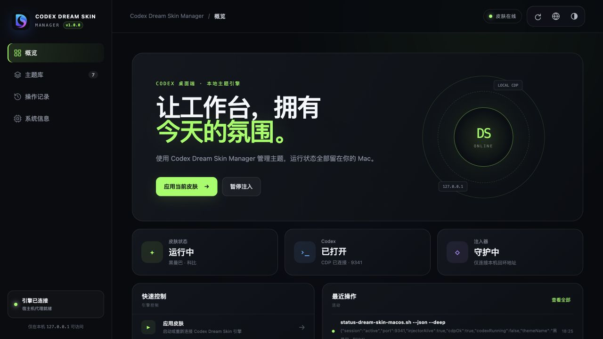

<p align="center">
  
</p>

<h1 align="center">Codex Dream Skin Manager</h1>

<p align="center">A local theme management panel for Codex Dream Skin on macOS.</p>

<p align="center">
  <a href="README.md">简体中文</a> · <strong>English</strong>
</p>

<p align="center">
  
  
  
  
  <a href="LICENSE"></a>
</p>

Codex Dream Skin Manager is an independent local Web GUI that manages themes, injection state, and the Codex connection through the macOS scripts supplied by the original project. It neither copies nor modifies the theme engine source code, and it does not modify the official Codex app.

> The current release targets macOS only and requires the [Codex Dream Skin](https://github.com/Fei-Away/Codex-Dream-Skin) theme engine.

## Preview



## Core Capabilities

### Theme Management

- Browse local preset and custom themes
- Preview theme backgrounds and identify the active theme
- Apply or reapply a theme with one click
- Delete custom themes with confirmation
- Protect preset themes and the active theme from accidental deletion

### Runtime Status

- Inspect the skin session, Codex, CDP, and injector state
- Apply the skin, pause injection, or restore the official appearance
- Review operation records from the current Host Agent lifecycle
- Manually refresh configuration, runtime state, themes, and logs

### User Experience

- Simplified Chinese and English UI
- System, light, and dark appearance modes
- Local system information, version display, and repository shortcuts
- Default entry point: `http://localhost:19341/management.html`

## Architecture

Docker Desktop runs Linux containers, which cannot directly execute macOS tools such as `launchctl`, `osascript`, or `sips`, and cannot control Codex on the host. The current deployment therefore combines a Web container with a local Host Agent:

```text
Browser
  │ http://localhost:19341/management.html
  ▼
Web container (static UI and API proxy)
  │ Random 256-bit Bearer Token
  ▼
Host Agent (local macOS Node.js process, port 4174)
  │ Allowlisted scripts and argument-array invocation
  ▼
Codex Dream Skin macOS scripts
```

| Component | Location | Purpose |
| --- | --- | --- |
| WebUI | Docker, `127.0.0.1:19341` | Serves the management UI and proxies API requests |
| Host Agent | macOS, port `4174` | Invokes local theme scripts and reads state |
| Theme Engine | Local macOS host | Injects themes and maintains configuration and CDP connectivity |

## Quick Start

### Requirements

- macOS
- Docker Desktop with Docker Compose
- Node.js 20+ on the host
- `Codex Dream Skin` installed, or `Codex-Dream-Skin/macos` available in a sibling directory

### Start

```bash
git clone https://github.com/StarRain/Codex-Dream-Skin-Manager.git
cd Codex-Dream-Skin-Manager
chmod +x scripts/start-local.sh scripts/stop-local.sh
./scripts/start-local.sh
```

Open:

```text
http://localhost:19341/management.html
```

You can also use the npm alias:

```bash
npm start
```

### Stop

```bash
./scripts/stop-local.sh
```

Or:

```bash
npm stop
```

## Selecting the Theme Engine Directory

The Host Agent resolves the engine directory in this order:

1. The `DREAM_SKIN_ENGINE` environment variable
2. The default installation directory: `~/.codex/codex-dream-skin-studio`
3. The sibling development directory: `../Codex-Dream-Skin/macos`

Specify the directory manually:

```bash
DREAM_SKIN_ENGINE="/absolute/path/to/Codex-Dream-Skin/macos" ./scripts/start-local.sh
```

## Data and Security

- The Web port binds to `127.0.0.1` only and is not exposed to the local network by default.
- Every Host Agent request requires a randomly generated 256-bit Bearer Token.
- The token file uses `0600` permissions and is mounted read-only inside the container.
- The container does not mount `~/.codex` or `~/Library/Application Support`.
- The API permits only allowlisted actions, scripts, and validated parameters.
- Write operations require a dedicated request marker to block ordinary cross-site form requests.
- Theme deletion is confined to the local theme library and preset themes are protected.
- Child processes are launched with executable and argument arrays; `sh -c` is not used.

## Development and Verification

Run unit tests:

```bash
npm test
```

Start the Host Agent only:

```bash
npm run agent
```

Validate or build the container:

```bash
docker compose config
docker compose build
```

For normal use, run `scripts/start-local.sh`. Starting the Web service by itself also requires the Host Agent address and token file.

## Related Projects

- [Codex Dream Skin](https://github.com/Fei-Away/Codex-Dream-Skin): theme engine, macOS scripts, and preset themes
- [Codex Dream Skin Manager](https://github.com/StarRain/Codex-Dream-Skin-Manager): local management UI and Host Agent

## License

This project is released under the [MIT License](LICENSE), Copyright (c) 2026 StarRain.

## Disclaimer

This is a community project and is not officially affiliated with or endorsed by OpenAI. Codex is a trademark of its respective owner.
